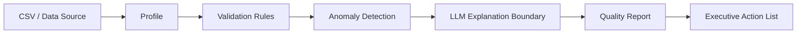

# AI Data Quality Agent

> A business-focused data quality pipeline that validates structured data, detects anomalies, and produces explainable quality findings.

[](https://github.com/SagarAnwekar/ai-data-quality-agent/actions/workflows/ci.yml)

## Problem

Data quality issues are expensive because analysts often discover them after reports fail or stakeholders lose confidence.

This project turns a raw CSV into a repeatable quality assessment with explicit rules, anomaly signals, and an explanation layer.

## Architecture



## Engineering contract

- deterministic validation rules first
- anomaly detection is separated from narrative generation
- LLM output is explanatory, not the source of truth
- synthetic/example data only
- tests cover core validation behavior
- CI runs on every pull request

## Target structure

```text
ai-data-quality-agent/
├── src/quality_agent/
│   ├── validation/
│   ├── profiling/
│   ├── anomalies/
│   ├── explanations/
│   └── reporting/
├── tests/
├── docs/
├── sample_data/
├── .github/
├── Dockerfile
├── docker-compose.yml
├── pyproject.toml
├── SECURITY.md
└── README.md
```

## Evaluation plan

| Dimension | Example metric |
|---|---|
| schema validity | invalid rows caught |
| completeness | null-rate detection |
| consistency | rule violations |
| anomaly precision | analyst-confirmed anomalies |
| explanation quality | groundedness / reviewer score |
| operational quality | runtime and failure rate |

## Status

**Milestone 1:** engineering baseline + health test. Subsequent commits will add profiling, validation, anomaly, explanation, and reporting implementations.

## License

MIT. See [`LICENSE`](LICENSE).
